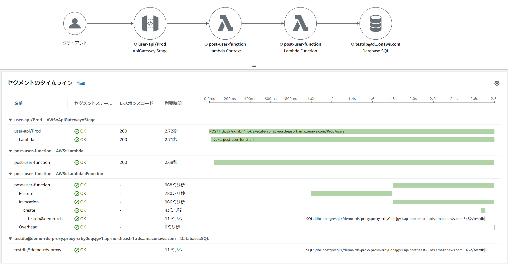

# Private APIでのAPIGatewayを使ったLambda/Java + Spring Boot&Spring Cloud FunctionのAWS SAMサンプルAP
# 構成イメージ
* Spring Cloud Functionを利用したAPIGateway/LambdaによるJavaアプリケーションを実装している。 また、Javaのコールドスタートの高速化対策のため、Lambda SnapStartを利用している。
    * 参考サイト
        * https://catalog.workshops.aws/java-on-aws-lambda/en-US/03-snapstart
        * https://maciejwalkowiak.com/blog/create-spring-cloud-function-aws-sam/
        * https://docs.spring.io/spring-cloud-function/docs/current/reference/html/

* API GatewayをPrivate APIで公開
    * VPC内にEC2で構築した、Bastionからアクセスする
* LambdaからDynamoDBやRDS AuroraへのDBアクセスを実現
    * LambdaはVPC内Lambdaとして、RDS Aurora（RDS Proxy経由）でのアクセスも可能としている


* X-Rayによる可視化
    * API Gateway、Lambdaにおいて、X-Rayによる可視化にも対応している    
    * RDB(RDS Aurora)へのアクセス、DynamoDBへのアクセスのトレースにも対応    
        * コールドスタートの例
            * Initializationが動作する代わりに、スナップショットをRestoreする処理が動くのが分かる

        * ウォームスタートの例
            * Restoreが発生せず処理しているのが分かる


## 事前準備
* 以下のライブラリを用いているので、EclipseのようなIDEを利用する場合には、プラグインのインストールが必要
    * [Lombok](https://projectlombok.org/)
        * [Eclipseへのプラグインインストール](https://projectlombok.org/setup/eclipse)
        * [IntelliJへのプラグインインストール](https://projectlombok.org/setup/intellij)
    * [Mapstruct](https://mapstruct.org/)
        * [EclipseやIntelliJへのプラグインインストール](https://mapstruct.org/documentation/ide-support/)

## 1. IAMの作成
```sh
#cfnフォルダに移動
cd cfn
aws cloudformation validate-template --template-body file://cfn-iam.yaml
aws cloudformation create-stack --stack-name Demo-IAM-Stack --template-body file://cfn-iam.yaml --capabilities CAPABILITY_IAM
```

## 2. VPCおよびサブネット、InternetGateway等の作成
```sh
aws cloudformation validate-template --template-body file://cfn-vpc.yaml
aws cloudformation create-stack --stack-name Demo-VPC-Stack --template-body file://cfn-vpc.yaml
```

## 3. Security Groupの作成
```sh
aws cloudformation validate-template --template-body file://cfn-sg.yaml
aws cloudformation create-stack --stack-name Demo-SG-Stack --template-body file://cfn-sg.yaml
```

## 4. VPC Endpointの作成とプライベートサブネットのルートテーブル更新
* VPC内LambdaからDynamoDBへアクセスするためのVPC Endpointを作成
```sh
aws cloudformation validate-template --template-body file://cfn-vpe.yaml
aws cloudformation create-stack --stack-name Demo-VPE-Stack --template-body file://cfn-vpe.yaml
```
## 5. NAT Gatewayの作成とプライベートサブネットのルートテーブル更新（任意）
* VPC内Lambdaからインターネットに接続する場合に必要となる。
* 現状、本サンプルAPでは、Lambda上のAPからインターネットに接続しないため、作成は任意である。

```sh
aws cloudformation validate-template --template-body file://cfn-ngw.yaml
aws cloudformation create-stack --stack-name Demo-NATGW-Stack --template-body file://cfn-ngw.yaml
```

## 6. RDS Aurora Serverless v2 for PostgreSQL、SecretsManager、RDS Proxy作成
* リソース作成に少し時間がかかる。(20分程度)
```sh
aws cloudformation validate-template --template-body file://cfn-rds.yaml
aws cloudformation create-stack --stack-name Demo-RDS-Stack --template-body file://cfn-rds.yaml --parameters ParameterKey=DBUsername,ParameterValue=postgres ParameterKey=DBPassword,ParameterValue=password
```

## 7. EC2(Bastion)の作成
* psqlによるRDBのテーブル作成や、APIGatewayのPrivate APIにアクセスするための踏み台を作成
```sh
aws cloudformation validate-template --template-body file://cfn-bastion-ec2.yaml
aws cloudformation create-stack --stack-name Demo-Bastion-Stack --template-body file://cfn-bastion-ec2.yaml
```

* 必要に応じてキーペア名等のパラメータを指定
    * 「--parameters ParameterKey=KeyPairName,ParameterValue=myKeyPair」

## 8. RDBのテーブル作成
* マネージドコンソールからEC2にセッションマネージャで接続し、Bastionにログインする。psqlをインストールし、DB接続する。
    * 以下参考に、Bastionにpsqlをインストールするとよい
        * https://techviewleo.com/how-to-install-postgresql-database-on-amazon-linux/
* DB接続後、ユーザテーブルを作成する。        
```sh
sudo amazon-linux-extras install epel

sudo tee /etc/yum.repos.d/pgdg.repo<<EOF
[pgdg14]
name=PostgreSQL 14 for RHEL/CentOS 7 - x86_64
baseurl=http://download.postgresql.org/pub/repos/yum/14/redhat/rhel-7-x86_64
enabled=1
gpgcheck=0
EOF

sudo yum makecache
sudo yum install postgresql14

#Auroraに直接接続
#CloudFormationのDemo-RDS-Stackスタックの出力「RDSClusterEndpointAddress」の値を参照
psql -h (Auroraのクラスタエンドポイント) -U postgres -d testdb    

#ユーザテーブル作成
CREATE TABLE IF NOT EXISTS m_user (user_id VARCHAR(50) PRIMARY KEY, user_name VARCHAR(50));
#ユーザテーブルの作成を確認
\dt
#いったん切断
\q

#RDS Proxyから接続しなおす
#CloudFormationのDemo-RDS-Stackスタックの出力「RDSProxyEndpoint」の値を参照
psql -h (RDS Proxyのエンドポイント) -U postgres -d testdb
#ユーザテーブルの存在を確認
\dt

```

## 9. DynamoDBのテーブル作成
* DynamoDBにTODOテーブルを作成する。
```sh
aws cloudformation validate-template --template-body file://cfn-dynamodb.yaml
aws cloudformation create-stack --stack-name Demo-DynamoDB-Stack --template-body file://cfn-dynamodb.yaml
```


## 10. AWS SAMでLambda/API Gatewayのデプロイ       
* SAMビルド    
```sh
# トップのフォルダに戻る
cd ..
mvn clean package
# Windowsでもmakeをインストールすればmakeでいけます
make
```

* SAMデプロイ
```sh
# 1回目は
sam deploy --guided
# Windowsでもmakeをインストールすればmakeでいけます
make deploy_guided

# 2回目以降は
sam deploy -t template.yaml
# Windowsでもmakeをインストールすればmakeでいけます
make deploy
```

## 11. APの実行確認
* マネージドコンソールから、EC2(Bation)へSystems Manager Session Managerで接続して、curlコマンドで動作確認
    * 以下の実行例のURLを、sam deployの結果出力される実際のURLをに置き換えること

* Userサービスでユーザ情報を登録するPOSTのAPI実行例
    * UserサービスはRDB(RDS Proxy経由でAuroraへ)アクセスするサンプルAP
```sh
curl -X POST -H "Content-Type: application/json" -d '{ "user_name" : "Taro"}' https://42b4c7bk9g.execute-api.ap-northeast-1.amazonaws.com/Prod/users

# 登録結果を返却
{"user_id":"99bf4d94-f6a4-11ed-85ec-be18af968bc1","user_name":"Taro"}
```

* Userサービスでユーザー情報を取得するGetのAPIの実行例（users/の後にPOSTのAPIで取得したユーザIDを指定）
```sh
curl https://42b4c7bk9g.execute-api.ap-northeast-1.amazonaws.com/Prod/users/99bf4d94-f6a4-11ed-85ec-be18af968bc1

# 対象のユーザ情報をRDBから取得し返却
{"user_id":"99bf4d94-f6a4-11ed-85ec-be18af968bc1","user_name":"Taro"}
```

* Todoサービスでやることリストを登録するPOSTのAPI実行例
    * TodoサービスはDynamoDBアクセスするサンプルAP
```sh
curl -X POST -H "Content-Type: application/json" -d '{ "todo_title" : "ミルクを買う"}' https://civuzxdd14.execute-api.ap-northeast-1.amazonaws.com/Prod/todo

# 登録結果を返却
{"todo_id":"04a14ad3-f6a5-11ed-b40f-f2ead45b980a","todo_title":"ミルクを買う"}
```

* Todoサービスでやること（TODO）を取得するGetのAPI実行例（todo/の後にPOSTのAPIで取得したTodo IDを指定）
```sh
curl https://civuzxdd14.execute-api.ap-northeast-1.amazonaws.com/Prod/todo/04a14ad3-f6a5-11ed-b40f-f2ead45b980a

# 対象のやることをDyanamoDBから取得し返却
{"todo_id":"04a14ad3-f6a5-11ed-b40f-f2ead45b980a","todo_title":"ミルクを買う"}
```
## 12. SAMのCloudFormationスタック削除
```sh
sam delete
# Windowsでもmakeをインストールすればmakeでいけます
make delete
```

## 13. その他リソースのCloudFormationスタック削除
```sh
aws cloudformation delete-stack --stack-name Demo-Bastion-Stack
aws cloudformation delete-stack --stack-name Demo-DynamoDB-Stack
aws cloudformation delete-stack --stack-name Demo-RDS-Stack
aws cloudformation delete-stack --stack-name Demo-NATGW-Stack
aws cloudformation delete-stack --stack-name Demo-VPE-Stack
aws cloudformation delete-stack --stack-name Demo-SG-Stack
aws cloudformation delete-stack --stack-name Demo-VPC-Stack 
aws cloudformation delete-stack --stack-name Demo-IAM-Stack 
```

## ソフトウェアフレームワーク
* 本サンプルアプリケーションでは、ソフトウェアフレームワーク実装例も同梱している。簡単のため、アプリケーションと同じプロジェクトでソース管理している。
* ソースコードはcom.example.fwパッケージ配下に格納されている。
    * 本格的な開発を実施する場合には、業務アプリケーションと別のGitリポジトリとして管理し、参照するようにすべきであるが、ここでは、あえて同じプロジェクトに格納してノウハウを簡単に参考にしてもらいやすいようにしている。
* 各機能と実現方式は、以下の通り。

| 機能 | 機能概要と実現方式 | 拡張実装 | 拡張実装の格納パッケージ |
| ---- | ---- | ---- | ---- |    
| オンラインAP制御 | Spring Cloud Functionの機能を利用し、APIの要求受信、ビジネスロジック実行、応答返却まで一連の定型的な処理を実行を制御する。 | - | - |
| トランザクション管理 | Spring Frameworkのトランザクション管理機能を利用して、@Transactionalアノテーションによる宣言的トランザクションを実現する機能を提供する。 | - | - |
| RDBアクセス | MyBatisやSpringとの統合機能を利用し、DBコネクション取得、SQLの実行等のRDBへのアクセスのため定型的な処理を実施し、ORマッピングやSQLマッピングと呼ばれるドメイン層とインフラ層のインピーダンスミスマッチを吸収する機能を提供する。 | - | - |
| DynamoDBアクセス | AWS SDK for Java 2.xのDynamoDB拡張クライアント（DynamoDbEnhancedClient）を使って、DBへのアクセス機能を提供する。 | ○ | com.example.fw.common.dynamodb |
| プロパティ管理 | SpringBootのプロパティ管理を使用して、APから環境依存のパラメータを切り出し、プロファイルによって動作環境に応じたパラメータ値に置き換え可能とする。 | - | - |
| オブジェクトマッピング | MapStructを利用し、類似のプロパティを持つリソースオブジェクトやDTOとドメインオブジェクト間で、値のコピーやデータ変換処理を簡単にかつ高速に行えるようにする。 | - | - |
| DI | Springを利用し、DI（依存性の注入）機能を提供する。 | - | - |
| AOP | SpringとAspectJAOPを利用し、AOP機能を提供する。 | - | - |
| ボイラープレートコード排除 | Lombokを利用し、オブジェクトのコンストラクタやGetter/Setter等のソースコードを自動生成し、ボイラープレートコードを排除する。 | - | - |

* 以下は、今後追加適用を検討中。

| 機能 | 機能概要と実現方式 | 拡張実装 | 拡張実装の格納パッケージ |
| ---- | ---- | ---- | ---- |
| 入力チェック| Java BeanValidationとSpringのValidation機能を利用し、単項目チェックや相関項目チェックといった画面の入力項目に対する形式的なチェックを実施する。 | ○ | com.example.fw.common.validation |
| 集約例外ハンドリング | エラー（例外）発生時、エラーログの出力、DBのロールバック、エラー画面やエラー電文の返却といった共通的なエラーハンドリングを実施する。 | ○ | 未定 |
| 例外 | RuntimeExceptionを継承し、エラーコード（メッセージID）やメッセージを管理可能な共通的なビジネス例外、システム例外を提供する。 | ○ | com.example.fw.common.exception |
| メッセージ管理 | MessageResourceでログに出力するメッセージを管理する。 | ○ | 未定 |
| ロギング | Slf4jとLogback、SpringBootのLogback拡張の機能を利用し、プロファイルによって動作環境に応じたログレベルや出力先（ファイルや標準出力）、出力形式（タブ区切りやJSON）に切替可能とする。またメッセージIDをもとにログ出力可能な汎用的なAPIを提供する。 | ○ | com.example.fw.common.logging |
| オブジェクトストレージ（S3）アクセス | AWS SDK for Java 2.xのS3クライアント（S3Client）を使って、S3のアクセス機能を提供する。開発時にS3アクセスできない場合を考慮して通常のファイルシステムへのFakeに切り替える。 | ○ | com.example.fw.common.objectstorage |


